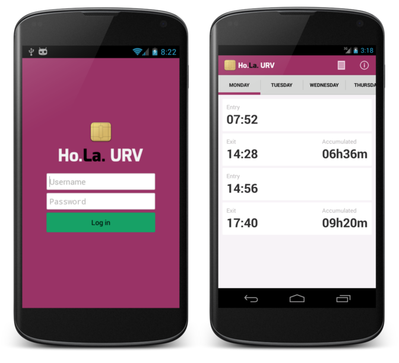

# Ho.La.URV

An android application for checking the presence management system of the Rovira i Virgili University  

## Table of contents
- [Features](#Features)
- [Dependencies](#Dependencies)
- [Roadmap](#Roadmap)

## Features

* Access with institutional credentials
* Display the time of entry, exit, and total time of the day
* Weekly report
* The password is not stored on the mobile device (safety)
* Compatibility with Android 2.3 and superior

## Dependencies

* [androidAnnotations 2.7.1](https://github.com/excilys/androidannotations)
* [httpmime 4.2.5](https://hc.apache.org/httpcomponents-client-ga/httpmime/)
* [Joda-Time 2.2.0](http://www.joda.org/joda-time/)
* [jsoup 1.7.2](http://jsoup.org/)
* [Mechanize 0.11.0](https://github.com/GistLabs/mechanize)

## Roadmap

If you want to contribute to the development of this application these are some of the tasks that need to be done:

* Switch the build process to Gradle

**
